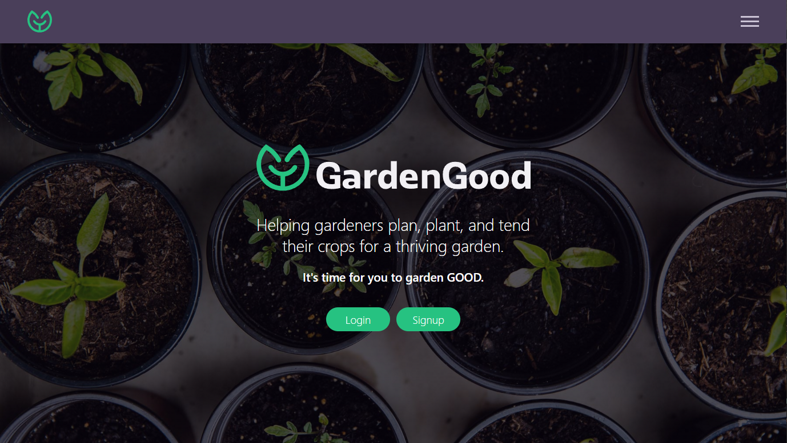

# **GardenGood App**

_Helping gardeners plan, plant, and tend their crops for a thriving garden._



The Garden Good app helps beginner and experienced gardeners plan, plant, and tend their crops for an abudant harvest. This app incorporates weather alerts to help you protect your garden from harsh conditions, and allow it to thrive. From proper feeding and watering to pruning, this app will help you garden GOOD.

I created the simplest form of this application during my time in Springboard's Software Engineering Bootcamp, but it is an ongoing project with more features planned. This first iteration allows users to search for plants and find information on how to take care of the plants in their garden. When a user signs up or logs in, the current weather conditions for their zip code is displayed in the top of the app. The users also have the ability to update their account information.

Live link: https://gardengood.surge.sh/

---

## Features

### Plant Directory

The backbone of this app is the plant directory. Users can find information on the plants they want to grow in their garden.

### Current Weather

Weather conditions are important for gardeners to properly care for their crops. So at all times, the current weather is displayed for the user to determine if the plants need extra attention based on weather conditions.

### Coming Soon: My Gardens

Expanding on the Plant Directory, this feature allows users to group and organize crops within multiple beds and gardens. This grouping allows users to digitally map out their actual gardens, and from these groups, the users can quickly find information on the plants that they are growing.

---

## Standard User Flow

1. A user logs into the app and lands on the home page where the current weather for the user's location is displayed.
2. After navigating to the 'Plants' page, where there is a large grid of plants.
3. The user can type into the search bar to filter plants by name.
4. When the user clicks their desired plant, plant care information is displayed.

---

## Weather API

The Weather API uses a user's zip code to provide current weather data to the user upon login.  
https://www.weatherapi.com/

---

## Technology Stack

This app was built in the PERN Stack.

- PostgreSQL
- Express
- React
- Node

The app was styled with vanilla CSS with a mobile-first responsive design approach. No UI frameworks were used.

---

## Cloning this Repo

```
git clone https://github.com/MattBaltzell/gardengood-frontend.git
```

### **Install Fontend Dependencies**

Navigate to 'gardengood-frontend' directory.  
Install all required dependencies with command:

```
npm install
```

### **Start the Frontend App**

While in the 'gardengood-frontend' root directory, run the command:

```
npm start
```

This command will open the application front-end in development mode under port `3000`.

Open http://localhost:3000 to view application in your browser.

---

# Getting Started with Create React App

This project was bootstrapped with [Create React App](https://github.com/facebook/create-react-app).

## Available Scripts

In the project directory, you can run:

### `npm start`

Runs the app in the development mode.\
Open [http://localhost:3000](http://localhost:3000) to view it in your browser.

The page will reload when you make changes.\
You may also see any lint errors in the console.

### `npm test`

Launches the test runner in the interactive watch mode.\
See the section about [running tests](https://facebook.github.io/create-react-app/docs/running-tests) for more information.

### `npm run build`

Builds the app for production to the `build` folder.\
It correctly bundles React in production mode and optimizes the build for the best performance.

The build is minified and the filenames include the hashes.\
Your app is ready to be deployed!

See the section about [deployment](https://facebook.github.io/create-react-app/docs/deployment) for more information.

### `npm run eject`

**Note: this is a one-way operation. Once you `eject`, you can't go back!**

If you aren't satisfied with the build tool and configuration choices, you can `eject` at any time. This command will remove the single build dependency from your project.

Instead, it will copy all the configuration files and the transitive dependencies (webpack, Babel, ESLint, etc) right into your project so you have full control over them. All of the commands except `eject` will still work, but they will point to the copied scripts so you can tweak them. At this point you're on your own.

You don't have to ever use `eject`. The curated feature set is suitable for small and middle deployments, and you shouldn't feel obligated to use this feature. However we understand that this tool wouldn't be useful if you couldn't customize it when you are ready for it.

## Learn More

You can learn more in the [Create React App documentation](https://facebook.github.io/create-react-app/docs/getting-started).

To learn React, check out the [React documentation](https://reactjs.org/).

### Code Splitting

This section has moved here: [https://facebook.github.io/create-react-app/docs/code-splitting](https://facebook.github.io/create-react-app/docs/code-splitting)

### Analyzing the Bundle Size

This section has moved here: [https://facebook.github.io/create-react-app/docs/analyzing-the-bundle-size](https://facebook.github.io/create-react-app/docs/analyzing-the-bundle-size)

### Making a Progressive Web App

This section has moved here: [https://facebook.github.io/create-react-app/docs/making-a-progressive-web-app](https://facebook.github.io/create-react-app/docs/making-a-progressive-web-app)

### Advanced Configuration

This section has moved here: [https://facebook.github.io/create-react-app/docs/advanced-configuration](https://facebook.github.io/create-react-app/docs/advanced-configuration)

### Deployment

This section has moved here: [https://facebook.github.io/create-react-app/docs/deployment](https://facebook.github.io/create-react-app/docs/deployment)

### `npm run build` fails to minify

This section has moved here: [https://facebook.github.io/create-react-app/docs/troubleshooting#npm-run-build-fails-to-minify](https://facebook.github.io/create-react-app/docs/troubleshooting#npm-run-build-fails-to-minify)
